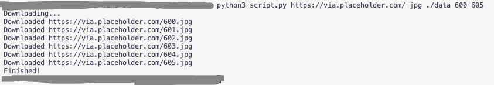

# Bulk Images Download
#### Video Demo:  https://youtu.be/IU75kYxI3VQ
#### Description:
This tool downloads bunch of images by provided url and range. This automates process of web scraping. It helps to download a lot of images. I found it really helpful for my personal usage.

## Why?

Automation is a very high-importance topic in the nowadays world. It helps to improve productive, reduce time of routine tasks. In the past I had times when I needed to download a hundreds of images from a website for my personal needs. I tried doing that by hand, and that lead me to some kind of depression =(

Then I realised that I can develop a tool which will help me to automate this process. Then I came to idea to implement "Bulk Images Download" tool. And since I developed it, I use it on everyday basis for my purposes. It has saved me so mush time and nerves since that day!

## Requirements
To be able to run this tool:

- Computer (any platform)
- Keyboard
- Mouse
- Python3 installed

### Python

Python installation you can find here: https://www.python.org/downloads/

## Running

**Repository:**

https://github.com/pigpudle/bulk-images-download

You need to clone source code from the above repository to some folder on your computer. Navigate to that folder.

From inside of that folder you can run this tool via command line (or terminal, or power shell) using this syntax:

`python3 script.py <url> <extension> <output_path> <from_range> <to_range>`

For example you want to download images in a rage from 'https://some-site.com/files/1.jpg' to 'https://some-site.com/files/10.jpg' into './data' folder. Then your command would look like this:

`python3 script.py https://some-site.com/files/ jpg ./data 1 10`

That's all!

> **Note**
> The `output_path` directory should exist before the script run.

## Demo

This is how you can use it:

`python3 script.py https://via.placeholder.com/ jpg ./data 600 605`

This command will download `https://via.placeholder.com/` images from 600.jpg to 605.jpg to your computer.

Here is an example of me doing that command:

.

## Development

### Source code

```
import os
import pprint
import time
import urllib.error
from urllib.request import Request, urlopen
import sys

def download_file(req, dst_path):
    try:
        with urllib.request.urlopen(req) as web_file:
            data = web_file.read()
            with open(dst_path, mode='wb') as local_file:
                local_file.write(data)
    except urllib.error.URLError as e:
        print(e)

def download_file_to_dir(req, url, dist_dir):
    download_file(req, os.path.join(dist_dir, os.path.basename(url)))

# validate args count
if not len(sys.argv) == 6:
  print("Invalid number of arguments")
  sys.exit()

orig_url = sys.argv[1]
extension = sys.argv[2]
dist_dir = sys.argv[3]
from_range = int(sys.argv[4])
to_range = int(sys.argv[5])

print("Downloading...")

for i in range(from_range, to_range+1):
  url = orig_url + str(i) + '.' + extension

  req = Request(
      url=url,
      headers={'User-Agent': 'Mozilla/5.0'}
  )
  download_file_to_dir(req, url, dist_dir)

  print("Downloaded " + url)

print("Finished!")
```

## Development decisions

1. I decided to use Python since it's very easy to use this language for this type of project.

2. I used `urllib` library for requests to download images.

3. I've used `{'User-Agent': 'Mozilla/5.0'}` header to come over bot-checks on different sites like this:

```
req = Request(
      url=url,
      headers={'User-Agent': 'Mozilla/5.0'}
  )
```

4. I've added prints to console to show a user the proccess of images downloading.

5. I save downloaded images with their original names, preserving numbers and extension format.

## Made by:

Neli (Minsk / Belarus)